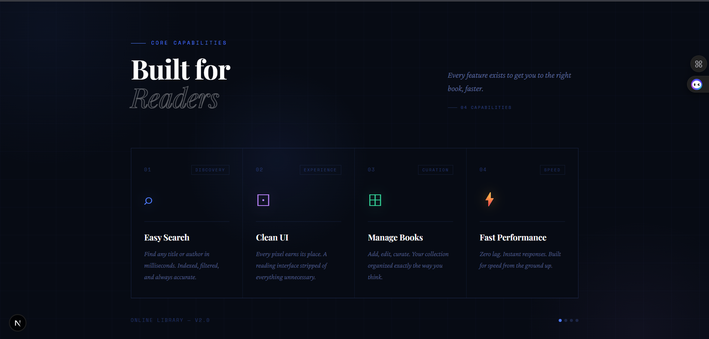
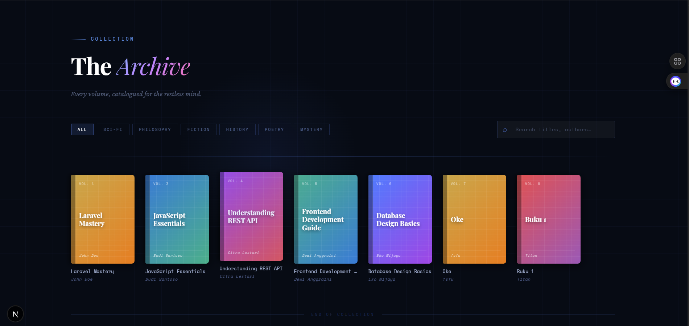
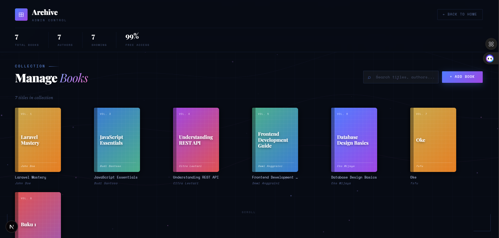

# 📚 Lib Aspire

**Lib Aspire** adalah sebuah aplikasi library online sederhana yang memungkinkan pengguna untuk menjelajahi dan mengelola koleksi buku dengan tampilan yang modern dan minimalis.

Project ini dibuat sebagai implementasi **CRUD (Create, Read, Update, Delete)** dengan dua halaman utama: **Landing Page** dan **Admin Management Page**.

---

## ✨ Features

- 📖 Browse dan eksplorasi buku
- 🔍 Search buku berdasarkan judul atau author
- ➕ Tambah buku (Create)
- ✏️ Edit buku (Update)
- ❌ Hapus buku (Delete)
- 🧑‍💻 Halaman admin khusus untuk manajemen data
- 🎨 UI modern & responsive (dark mode support)

---

## 🖥️ Pages

### 🌐 Landing Page
- Menampilkan daftar buku
- Fitur search
- UI clean & user-friendly

### ⚙️ Admin Page
- CRUD buku (Create, Read, Update, Delete)
- Modal form untuk tambah/edit buku

---

## 📸 Screenshots


### Landing Page






### Admin Page

---

## ⚙️ Tech Stack

- ⚛️ React / Next.js
- 🎨 Tailwind CSS
- 🔗 API (Laravel / Backend service)
- 📦 React Icons

---

## 🚀 Installation & Setup

Ikuti langkah berikut untuk menjalankan project secara lokal:

### 1. Clone Repository

```bash
git clone https://github.com/username/lib-aspire.git
cd lib-aspire
```

### 2. Clone Repository

```bash
npm install
```


### 3. Setup Environment
Rename file:
    .env.example

menjadi:
    .env.local
    
Lalu sesuaikan konfigurasi (misalnya API URL).


### 5. Run Project
```bash
npm run dev
```
